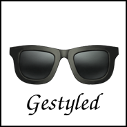

A React UI component library based on [styled-components](http://styled-components.com). 🕶️

[](https://travis-ci.org/mikebarkmin/gestyled) [](https://david-dm.org/mikebarkmin/gestyled) [](https://badge.fury.io/js/gestyled)

```sh
npm install --save gestyled
# or if you're using yarn
yarn add gestyled
```

## Usage

```javascript
import React from 'react';
import { ThemeProvider, Button } from 'gestyled';

const App = props => (
    <ThemeProvider>
        <Button>Press me!</Button>
    </ThemeProvider>
);
```

## Component Showcase

**See all components with possible props at [projects.barkmin.eu/gestyled](http://projects.barkmin.eu/gestyled)!**

## Base Props
All components are wrapped in a higher order component that handles design-system-based responsive style props using [styled-system](https://github.com/jxnblk/styled-system).

This idea is based on jxnblk's awesome functional React UI component library [rebass](https://github.com/jxnblk/rebass), which is also based on [styled-components](http://styled-components.com).

## Theme Support
You can use the styled-component ThemeProvider to theme the components. A default material theme can be found [here](src/theme/material.js). This theme is also used, when no other theme is provided.

## Licence

Copyright © 2017 Mike Barkmin. Licensed under the MIT License, see [LICENSE.md](LICENSE.md) for more information!  

